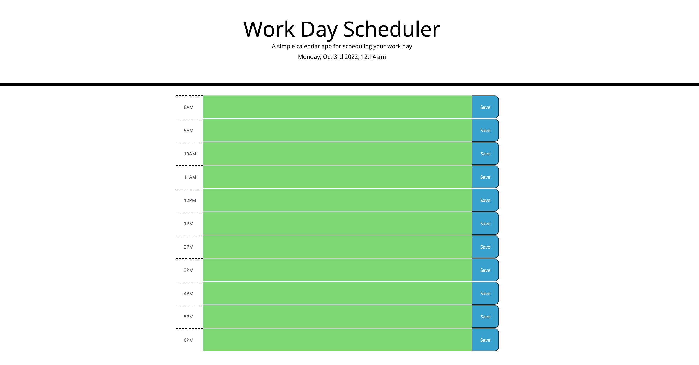
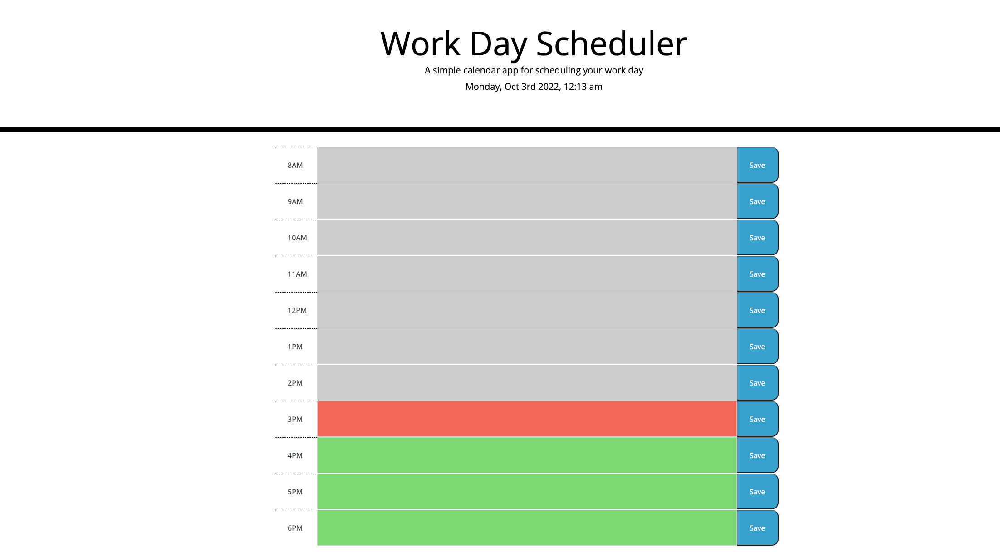

# Work-Day-Scheduler

## Description

This projects serves as a schedule that a user can use throughout their workday. Each hour has its own section that they are able to add a note to and save it to the page so they can come back and view the note later. In building this project, it helped me learn a lot about the jQuery library, bootstrap and also moment.js.

## Usage

When the website is loaded, the user is shown a workday schedule, broken into sections for each hour of their workday. This website will also display the current date and time at the top of the page.

Another featue of this website that was added is based on the current time of the user's workday. I used javascript and css to have the color of the time blocks change if the time block is in the past, present, or future. If a time block is in the past, its background color will display a gray color. If it is in the present, it will display red. And if it is in the future, it will display green. Here is a demo if what it could look like in the middle of the user's workday.

The last feature that was put into this website is the note saving option. If a user clicks on one of the text inputs throughout the day, they can type in a note as a reminder of a task they may have to complete by that time. In order for the user to be able to enter a note, leave the webpage, and then later return to the notes they entered, they will need to click on the "Save" button to save the button to the website's local storage. The user will now be able to save a note on the webpage and also refresh the page to display the current time without losing their note.

## Links

https://richiethie.github.io/work-day-scheduler-05/
